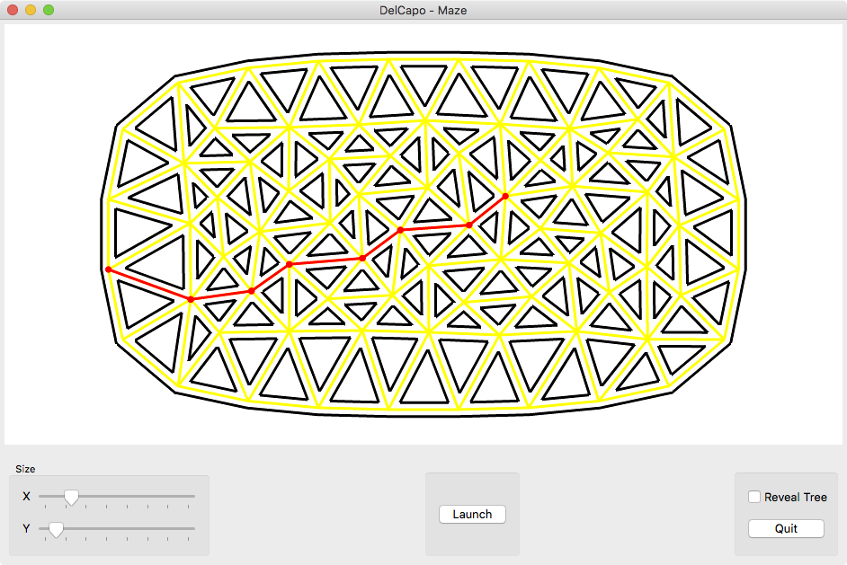
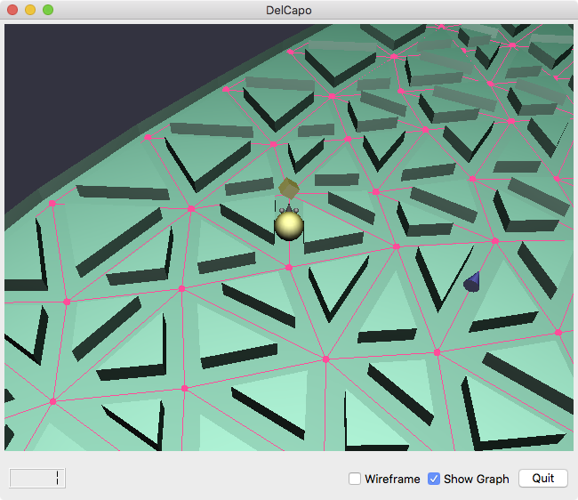

## Game Prelude

The maze is generated procedurally. The dimensions of the maze can be changed interactively using two sliders. The shortest path is illustrated interactively following mouse hovering.

## Game

A 3D maze is extruded from the procedural maze. The user interface requires the selection of left/right turns at the next junction.

